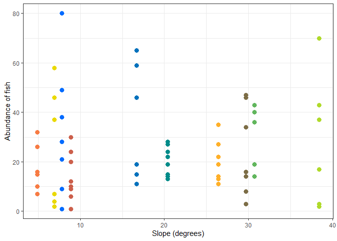
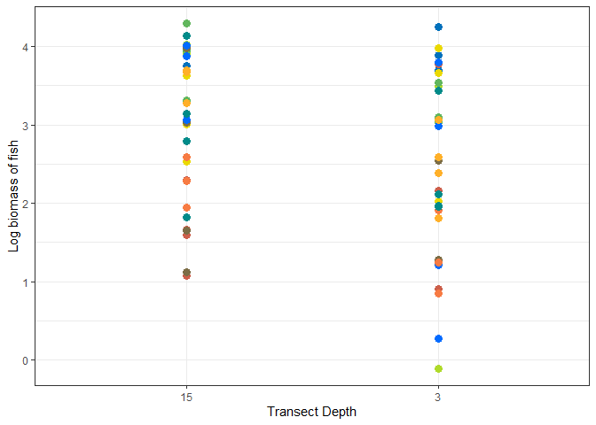
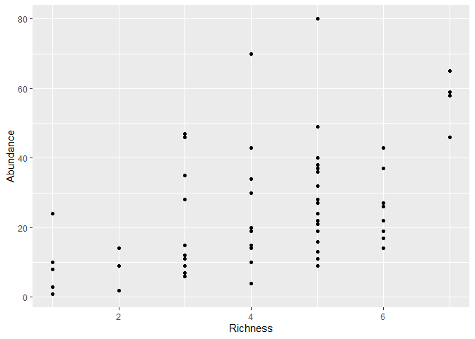
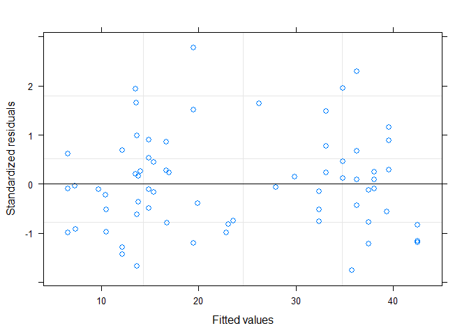

Mixed models for hi-Lo fish analysis
================
Fiona Francis
5/19/2021

These are the data analyses for Jill Campbell’s MSc chapter that
complements the HiLo analysis for Sharon Jeffrey’s invert data. This
analysis examines the effect of current and other abiotic factors on
fish abundance, biomass, and diversity at different sites in the Gulf
Islands. THe data was collected slightly differently than the
invertebrate data so the number of points and sites differ between the
two studies. This project also involvles collaborators Sharon Jeffery
(DFO), Sarah Dudas(DFO), and Francis Juanes(Uvic).

Jill used a total of 10 sites and recorded fish on transects at two
depths at each site: 3 m and 15 m. Each site was visited 3 or 4 times
over the season. Current speed was measured at each site over the course
of one month and the analyses use the mean daily max current measures.
Site will be included as a random effect in models. Abiotic factors are
current speed, depth, rock cover.

## Data summaries

    ## # A tibble: 69 x 18
    ##    Site     CurrentMax CurrentMean.x Hi_Lo TransectDepth CurrDepth Replicate
    ##    <chr>         <dbl>         <dbl> <chr>         <dbl> <chr>         <dbl>
    ##  1 Porlier        117.          64.0 High              3 High 3m           1
    ##  2 Porlier        117.          64.0 High              3 High 3m           2
    ##  3 Porlier        117.          64.0 High              3 High 3m           3
    ##  4 Porlier        117.          64.0 High             15 High 15m          1
    ##  5 Porlier        117.          64.0 High             15 High 15m          2
    ##  6 Porlier        117.          64.0 High             15 High 15m          3
    ##  7 Grainger       114.          19.6 High              3 High 3m           1
    ##  8 Grainger       114.          19.6 High              3 High 3m           2
    ##  9 Grainger       114.          19.6 High              3 High 3m           3
    ## 10 Grainger       114.          19.6 High             15 High 15m          1
    ## # ... with 59 more rows, and 11 more variables: TransectID <chr>,
    ## #   Richness <dbl>, Abundance <dbl>, Biomass <dbl>, Biomass_kg <dbl>,
    ## #   SlopeAngle <dbl>, PercRock <dbl>, CurrentMin <dbl>, MedianMax <dbl>,
    ## #   meanCurrentSD <dbl>, maxCurrentSD <dbl>

## Exploratory plots of abundance

### Plots of current and transect depth


### Plots of slope and rock cover



## Same plots but of biomass instead of abundance

We are logging biomass to make the relationship more linear.

### Plots of current and depth



### Plots of slope and rock cover


# Plots of abundance, biomass, and richness

Just for interest sake, I don’t know if the correlation between these
dependent variables is important and needs to be considered? Food for
thought.



# Models of fish abundance

In all models site is included as a random factor and there are four
variables (Transect depth, max daily current, slope, percent rock). We
are looking at all combinations of variables but with no interactions.

``` r
#one variable

Null.ab <- lme(Abundance ~ 1, 
            random = ~ 1 | Site, data = data, method = "ML")

Lm1.ab <-  lme(Abundance ~ TransectDepth, 
            random = ~ 1 | Site, data = data, method = "ML")

Lm2.ab <-  lme(Abundance ~ CurrentMax,
            random = ~ 1 | Site, data = data, method = "ML")

Lm3.ab <- lme(Abundance ~ SlopeAngle,
            random = ~ 1 | Site, data = data, method = "ML")

Lm4.ab <- lme(Abundance ~ PercRock,
            random = ~ 1 | Site, data = data, method = "ML")

#two variables

Lm5.ab  <- lme(Abundance ~ TransectDepth + CurrentMax, 
            random = ~ 1 | Site, data = data, method = "ML")

Lm6.ab  <- lme(Abundance ~ TransectDepth + SlopeAngle, 
            random = ~ 1 | Site, data = data, method = "ML")

Lm7.ab  <- lme(Abundance ~ TransectDepth + PercRock, 
            random = ~ 1 | Site, data = data, method = "ML")

Lm8.ab  <- lme(Abundance ~ SlopeAngle + CurrentMax, 
            random = ~ 1 | Site, data = data, method = "ML")

Lm9.ab  <- lme(Abundance ~ SlopeAngle + PercRock, 
            random = ~ 1 | Site, data = data, method = "ML")

Lm10.ab  <- lme(Abundance ~ PercRock + CurrentMax, 
            random = ~ 1 | Site, data = data, method = "ML")

#Three variables
Lm11.ab  <- lme(Abundance ~ CurrentMax + SlopeAngle + PercRock, 
            random = ~ 1 | Site, data = data, method = "ML")

Lm12.ab  <- lme(Abundance ~ TransectDepth + SlopeAngle + PercRock, 
            random = ~ 1 | Site, data = data, method = "ML")

Lm13.ab  <- lme(Abundance ~ TransectDepth + CurrentMax + PercRock, 
            random = ~ 1 | Site, data = data, method = "ML")

Lm14.ab  <- lme(Abundance ~ TransectDepth + CurrentMax + SlopeAngle, 
            random = ~ 1 | Site, data = data, method = "ML")
# four variables

Lm15.ab  <- lme(Abundance ~ CurrentMax + TransectDepth + SlopeAngle + PercRock, 
            random = ~ 1 | Site, data = data, method = "ML")


bbmle::AICtab(Null.ab, Lm1.ab, Lm2.ab, Lm3.ab, Lm4.ab, Lm5.ab, Lm6.ab, Lm7.ab, Lm8.ab, Lm9.ab, Lm10.ab, Lm11.ab, Lm12.ab, Lm13.ab, Lm14.ab, Lm15.ab, base = T, weights = T, logLik = T)
```

    ##         logLik AIC    dLogLik dAIC   df weight
    ## Lm7.ab  -278.4  566.9   17.2     0.0 5  0.4864
    ## Lm12.ab -278.3  568.6   17.3     1.7 6  0.2030
    ## Lm13.ab -278.4  568.8   17.2     1.9 6  0.1852
    ## Lm15.ab -278.3  570.6   17.3     3.7 7  0.0758
    ## Lm1.ab  -282.6  573.1   13.0     6.3 4  0.0213
    ## Lm5.ab  -282.1  574.2   13.5     7.3 5  0.0127
    ## Lm6.ab  -282.3  574.6   13.3     7.7 5  0.0101
    ## Lm14.ab -281.9  575.9   13.7     9.0 6  0.0054
    ## Null.ab -295.6  597.2    0.0    30.4 3  <0.001
    ## Lm4.ab  -294.8  597.5    0.9    30.6 4  <0.001
    ## Lm2.ab  -295.3  598.6    0.3    31.7 4  <0.001
    ## Lm3.ab  -295.4  598.7    0.2    31.9 4  <0.001
    ## Lm9.ab  -294.6  599.2    1.0    32.3 5  <0.001
    ## Lm10.ab -294.7  599.3    1.0    32.4 5  <0.001
    ## Lm8.ab  -295.1  600.3    0.5    33.4 5  <0.001
    ## Lm11.ab -294.5  601.0    1.1    34.2 6  <0.001

## Diagnositics for model 7

There are three models that are within 2 AIC but we are going to explore
the diagnostics of the first one (model 7) to see if it is even a decent
model.

``` r
# diagnostics for Lm7.ab

Lm7.ab
```

    ## Linear mixed-effects model fit by maximum likelihood
    ##   Data: data 
    ##   Log-likelihood: -278.4377
    ##   Fixed: Abundance ~ TransectDepth + PercRock 
    ##    (Intercept) TransectDepth3       PercRock 
    ##      7.8281051    -21.7561013      0.2947264 
    ## 
    ## Random effects:
    ##  Formula: ~1 | Site
    ##         (Intercept) Residual
    ## StdDev:    2.061944 13.53999
    ## 
    ## Number of Observations: 69
    ## Number of Groups: 10

``` r
summary(Lm7.ab)
```

    ## Linear mixed-effects model fit by maximum likelihood
    ##   Data: data 
    ##        AIC     BIC    logLik
    ##   566.8754 578.046 -278.4377
    ## 
    ## Random effects:
    ##  Formula: ~1 | Site
    ##         (Intercept) Residual
    ## StdDev:    2.061944 13.53999
    ## 
    ## Fixed effects:  Abundance ~ TransectDepth + PercRock 
    ##                     Value Std.Error DF   t-value p-value
    ## (Intercept)      7.828105  9.235819 57  0.847581  0.4002
    ## TransectDepth3 -21.756101  3.413470 57 -6.373603  0.0000
    ## PercRock         0.294726  0.101549 57  2.902300  0.0053
    ##  Correlation: 
    ##                (Intr) TrnsD3
    ## TransectDepth3  0.033       
    ## PercRock       -0.965 -0.214
    ## 
    ## Standardized Within-Group Residuals:
    ##         Min          Q1         Med          Q3         Max 
    ## -2.14378970 -0.60305184 -0.07379848  0.40969801  3.11518620 
    ## 
    ## Number of Observations: 69
    ## Number of Groups: 10

``` r
plot(Lm7.ab) # pretty cone shaped which isn't great
```

<!-- -->

``` r
ggplot(data.frame(biomass=predict(Lm7.ab,type="link"),pearson=residuals(Lm1.ab,type="pearson")), # another way to visualize
       aes(x=biomass,y=pearson)) +
  geom_point() +
  theme_bw()
```

<!-- -->

``` r
qqnorm(resid(Lm7.ab)) #decent
```

<!-- -->

## Fitting a variance structure to model 7

Because there is a pretty obvious pattern in the residuals I am going to
fit a variance structure to the model to see if this fixes this problem.
I’ll first fit it to model 7 and then if that corrects the skew I will
fit the same structure to ALL of the original model set and then compare
all of the models again.

``` r
Lm7.ab.var <- lme(Abundance ~ TransectDepth + PercRock, 
            random = ~ 1 | Site, data = data, method = "ML")

Lm7.ab.var <- update(Lm7.ab, weights = varExp(form = ~fitted(.)),method = "ML") # update model 7 with an exponential variance structure

Lm7.ab.var
```

    ## Linear mixed-effects model fit by maximum likelihood
    ##   Data: data 
    ##   Log-likelihood: -270.0596
    ##   Fixed: Abundance ~ TransectDepth + PercRock 
    ##    (Intercept) TransectDepth3       PercRock 
    ##      5.7776564    -22.6589837      0.3180642 
    ## 
    ## Random effects:
    ##  Formula: ~1 | Site
    ##         (Intercept) Residual
    ## StdDev:    4.317863 4.290941
    ## 
    ## Variance function:
    ##  Structure: Exponential of variance covariate
    ##  Formula: ~fitted(.) 
    ##  Parameter estimates:
    ##      expon 
    ## 0.04114667 
    ## Number of Observations: 69
    ## Number of Groups: 10

``` r
plot(Lm7.ab.var)
```

<!-- -->

``` r
qqnorm(Lm7.ab.var)
```

<!-- -->

``` r
# rerun all models with new variance structure
Null.ab.var <- update(Null.ab, weights = varExp(form = ~fitted(.)),method = "ML")
Lm1.ab.var <- update(Lm1.ab, weights = varExp(form = ~fitted(.)),method = "ML")
Lm2.ab.var <- update(Lm2.ab, weights = varExp(form = ~fitted(.)),method = "ML")
Lm3.ab.var <- update(Lm3.ab, weights = varExp(form = ~fitted(.)),method = "ML")
Lm4.ab.var <- update(Lm4.ab, weights = varExp(form = ~fitted(.)),method = "ML")
Lm5.ab.var <- update(Lm5.ab, weights = varExp(form = ~fitted(.)),method = "ML")
Lm6.ab.var <- update(Lm6.ab, weights = varExp(form = ~fitted(.)),method = "ML")
Lm7.ab.var <- update(Lm7.ab, weights = varExp(form = ~fitted(.)),method = "ML")
Lm8.ab.var <- update(Lm8.ab, weights = varExp(form = ~fitted(.)),method = "ML")
Lm9.ab.var <- update(Lm9.ab, weights = varExp(form = ~fitted(.)),method = "ML")
Lm10.ab.var <- update(Lm10.ab, weights = varExp(form = ~fitted(.)),method = "ML")
Lm11.ab.var <- update(Lm11.ab, weights = varExp(form = ~fitted(.)),method = "ML")
Lm12.ab.var <- update(Lm12.ab, weights = varExp(form = ~fitted(.)),method = "ML")
Lm13.ab.var <- update(Lm13.ab, weights = varExp(form = ~fitted(.)),method = "ML")
Lm14.ab.var <- update(Lm14.ab, weights = varExp(form = ~fitted(.)),method = "ML")
Lm15.ab.var <- update(Lm15.ab, weights = varExp(form = ~fitted(.)),method = "ML")

bbmle::AICtab(Null.ab.var, Lm1.ab.var, Lm2.ab.var, Lm3.ab.var, Lm4.ab.var, Lm5.ab.var, Lm6.ab.var, Lm7.ab.var, Lm8.ab.var, Lm9.ab.var, 
              Lm10.ab.var, Lm11.ab.var, Lm12.ab.var, Lm13.ab.var, Lm14.ab.var, Lm15.ab.var, base = T, weights = T, logLik = T)
```

    ##             logLik AIC    dLogLik dAIC   df weight
    ## Lm13.ab.var -268.2  550.5   27.4     0.0 7  0.4828
    ## Lm7.ab.var  -270.1  552.1   25.6     1.7 6  0.2105
    ## Lm15.ab.var -268.2  552.3   27.5     1.9 8  0.1910
    ## Lm12.ab.var -269.7  553.5   25.9     3.0 7  0.1067
    ## Lm14.ab.var -272.7  559.4   22.9     8.9 7  0.0056
    ## Lm6.ab.var  -274.8  561.5   20.9    11.0 6  0.0019
    ## Lm1.ab.var  -276.7  563.3   18.9    12.9 5  <0.001
    ## Lm5.ab.var  -276.0  564.0   19.6    13.5 6  <0.001
    ## Lm4.ab.var  -292.5  595.1    3.1    44.6 5  <0.001
    ## Lm10.ab.var -292.0  596.0    3.6    45.5 6  <0.001
    ## Lm2.ab.var  -293.8  597.6    1.8    47.2 5  <0.001
    ## Lm9.ab.var  -293.5  599.0    2.1    48.6 6  <0.001
    ## Null.ab.var -295.6  599.2    0.0    48.8 4  <0.001
    ## Lm3.ab.var  -295.3  600.6    0.3    50.2 5  <0.001
    ## Lm11.ab.var -293.6  601.2    2.0    50.7 7  <0.001
    ## Lm8.ab.var  -294.8  601.7    0.8    51.2 6  <0.001

## Diagnostics for Model 13 (TransectDepth + CurrentMax + PercRock)

We are looking here at model 13 but there are 3 models (13, 7 and 15)
which are all within 2 delta AIC.

``` r
# diagnostics for Lm13.ab.var

Lm13.ab.var
```

    ## Linear mixed-effects model fit by maximum likelihood
    ##   Data: data 
    ##   Log-likelihood: -268.2296
    ##   Fixed: Abundance ~ TransectDepth + CurrentMax + PercRock 
    ##    (Intercept) TransectDepth3     CurrentMax       PercRock 
    ##     7.34385454   -23.32711495    -0.06542779     0.34703007 
    ## 
    ## Random effects:
    ##  Formula: ~1 | Site
    ##         (Intercept) Residual
    ## StdDev:    3.591154  4.02934
    ## 
    ## Variance function:
    ##  Structure: Exponential of variance covariate
    ##  Formula: ~fitted(.) 
    ##  Parameter estimates:
    ##      expon 
    ## 0.04262456 
    ## Number of Observations: 69
    ## Number of Groups: 10

``` r
summary(Lm13.ab.var)
```

    ## Linear mixed-effects model fit by maximum likelihood
    ##   Data: data 
    ##        AIC      BIC    logLik
    ##   550.4592 566.0979 -268.2296
    ## 
    ## Random effects:
    ##  Formula: ~1 | Site
    ##         (Intercept) Residual
    ## StdDev:    3.591154  4.02934
    ## 
    ## Variance function:
    ##  Structure: Exponential of variance covariate
    ##  Formula: ~fitted(.) 
    ##  Parameter estimates:
    ##      expon 
    ## 0.04262456 
    ## Fixed effects:  Abundance ~ TransectDepth + CurrentMax + PercRock 
    ##                     Value Std.Error DF   t-value p-value
    ## (Intercept)      7.343855  6.882005 57  1.067110  0.2904
    ## TransectDepth3 -23.327115  3.516930 57 -6.632805  0.0000
    ## CurrentMax      -0.065428  0.038570  8 -1.696332  0.1283
    ## PercRock         0.347030  0.087101 57  3.984239  0.0002
    ##  Correlation: 
    ##                (Intr) TrnsD3 CrrntM
    ## TransectDepth3  0.129              
    ## CurrentMax     -0.078  0.042       
    ## PercRock       -0.854 -0.496 -0.232
    ## 
    ## Standardized Within-Group Residuals:
    ##         Min          Q1         Med          Q3         Max 
    ## -1.82504777 -0.77554621 -0.02917263  0.56913154  2.71370049 
    ## 
    ## Number of Observations: 69
    ## Number of Groups: 10

``` r
plot(Lm13.ab.var)
```

<!-- -->

``` r
ggplot(data.frame(biomass=predict(Lm13.ab.var,type="link"),pearson=residuals(Lm13.ab.var,type="pearson")),
       aes(x=biomass,y=pearson)) +
  geom_point() +
  theme_bw()
```

<!-- -->

``` r
qqnorm(resid(Lm13.ab.var))
```

<!-- -->

``` r
sjPlot::plot_model(Lm13.ab.var)
```

<!-- -->

# Models of fish biomass

    ##          logLik AIC    dLogLik dAIC   df weight
    ## Lm1.bio   -95.9  199.9  574.6     0.0 4  0.2708
    ## Lm6.bio   -95.5  201.0  575.0     1.1 5  0.1524
    ## Lm5.bio   -95.6  201.1  575.0     1.2 5  0.1471
    ## Lm7.bio   -95.6  201.1  575.0     1.2 5  0.1469
    ## Lm12.bio  -95.1  202.3  575.4     2.4 6  0.0828
    ## Lm14.bio  -95.3  202.5  575.3     2.7 6  0.0719
    ## Lm13.bio  -95.3  202.6  575.3     2.7 6  0.0711
    ## Null.bio  -99.7  205.4  570.9     5.5 3  0.0174
    ## Lm3.bio   -99.2  206.5  571.3     6.6 4  0.0101
    ## Lm2.bio   -99.3  206.6  571.2     6.8 4  0.0093
    ## Lm4.bio   -99.7  207.3  570.9     7.4 4  0.0066
    ## Lm8.bio   -99.0  208.0  571.5     8.1 5  0.0047
    ## Lm9.bio   -99.2  208.4  571.3     8.5 5  0.0039
    ## Lm10.bio  -99.3  208.6  571.2     8.7 5  0.0034
    ## Lm11.bio  -99.0  210.0  571.5    10.1 6  0.0017
    ## Lm15.bio -670.5 1355.1    0.0  1155.2 7  <0.001

## Looking at model 1 but again there are 4 models within 2 delta AIC (1, 6, 5, and 7). Depth is clearly very important but the other three models contain each of the other variables of interest.

    ## Linear mixed-effects model fit by maximum likelihood
    ##   Data: data 
    ##   Log-likelihood: -95.94696
    ##   Fixed: log10(Biomass) ~ TransectDepth 
    ##    (Intercept) TransectDepth3 
    ##      3.0615475     -0.6088996 
    ## 
    ## Random effects:
    ##  Formula: ~1 | Site
    ##         (Intercept)  Residual
    ## StdDev:   0.5059858 0.8934504
    ## 
    ## Number of Observations: 69
    ## Number of Groups: 10

<!-- --><!-- --><!-- --><!-- --><!-- --><!-- -->

# Models of fish species richness

In all models site is included as a random factor and there are four
variables (Transect depth, max daily current, slope, percent rock). We
are looking at all combinations of variables but with no interactions.

``` r
#one variable

Null.r <- lme(Richness ~ 1, 
            random = ~ 1 | Site, data = data, method = "ML")

Lm1.r <-  lme(Richness ~ TransectDepth, 
            random = ~ 1 | Site, data = data, method = "ML")

Lm2.r <-  lme(Richness ~ CurrentMax,
            random = ~ 1 | Site, data = data, method = "ML")

Lm3.r <- lme(Richness ~ SlopeAngle,
            random = ~ 1 | Site, data = data, method = "ML")

Lm4.r <- lme(Richness ~ PercRock,
            random = ~ 1 | Site, data = data, method = "ML")

#two variables

Lm5.r  <- lme(Richness ~ TransectDepth + CurrentMax, 
            random = ~ 1 | Site, data = data, method = "ML")

Lm6.r  <- lme(Richness ~ TransectDepth + SlopeAngle, 
            random = ~ 1 | Site, data = data, method = "ML")

Lm7.r  <- lme(Richness ~ TransectDepth + PercRock, 
            random = ~ 1 | Site, data = data, method = "ML")

Lm8.r  <- lme(Richness ~ SlopeAngle + CurrentMax, 
            random = ~ 1 | Site, data = data, method = "ML")

Lm9.r  <- lme(Richness ~ SlopeAngle + PercRock, 
            random = ~ 1 | Site, data = data, method = "ML")

Lm10.r  <- lme(Richness ~ PercRock + CurrentMax, 
            random = ~ 1 | Site, data = data, method = "ML")

#Three variables
Lm11.r  <- lme(Richness ~ CurrentMax + SlopeAngle + PercRock, 
            random = ~ 1 | Site, data = data, method = "ML")

Lm12.r  <- lme(Richness ~ TransectDepth + SlopeAngle + PercRock, 
            random = ~ 1 | Site, data = data, method = "ML")

Lm13.r  <- lme(Richness ~ TransectDepth + CurrentMax + PercRock, 
            random = ~ 1 | Site, data = data, method = "ML")

Lm14.r  <- lme(Richness ~ TransectDepth + CurrentMax + SlopeAngle, 
            random = ~ 1 | Site, data = data, method = "ML")
# four variables

Lm15.r  <- lme(Richness ~ CurrentMax + TransectDepth + SlopeAngle + PercRock, 
            random = ~ 1 | Site, data = data, method = "ML")


bbmle::AICtab(Null.r, Lm1.r, Lm2.r, Lm3.r, Lm4.r, Lm5.r, Lm6.r, Lm7.r, Lm8.r, Lm9.r, Lm10.r, Lm11.r, Lm12.r, Lm13.r, Lm14.r, Lm15.r, base = T, weights = T, logLik = T)
```

    ##        logLik AIC    dLogLik dAIC   df weight
    ## Lm7.r  -122.2  254.5    7.4     0.0 5  0.2786
    ## Lm1.r  -123.4  254.8    6.2     0.3 4  0.2414
    ## Lm13.r -122.1  256.2    7.5     1.7 6  0.1173
    ## Lm12.r -122.2  256.5    7.4     2.0 6  0.1036
    ## Lm5.r  -123.4  256.7    6.3     2.3 5  0.0904
    ## Lm6.r  -123.4  256.8    6.2     2.3 5  0.0888
    ## Lm15.r -122.1  258.2    7.5     3.7 7  0.0432
    ## Lm14.r -123.4  258.7    6.3     4.3 6  0.0333
    ## Null.r -129.6  265.3    0.0    10.8 3  0.0013
    ## Lm4.r  -129.5  266.9    0.2    12.4 4  <0.001
    ## Lm2.r  -129.6  267.2    0.0    12.7 4  <0.001
    ## Lm3.r  -129.6  267.3    0.0    12.8 4  <0.001
    ## Lm10.r -129.4  268.8    0.3    14.3 5  <0.001
    ## Lm9.r  -129.5  268.9    0.2    14.4 5  <0.001
    ## Lm8.r  -129.6  269.2    0.0    14.7 5  <0.001
    ## Lm11.r -129.4  270.8    0.3    16.3 6  <0.001

``` r
plot(Lm7.r)
```

<!-- -->

``` r
qqnorm(resid(Lm7.r))
```

<!-- -->

## Length and depth relationships

Jill is interested in understanding how fish length changes in relation
to species and in relation to depth. Are some species larger at deeper
depths than others despite species differences?

I think that this can be modeled in two ways.

1.  we fit a random effect for species where the slopes and intercepts
    vary by species to see if there is an overal effect of depth on fish
    size. I don’t think that we need to worry about site ID as there
    would be no reason to expect fish to have different life history
    traits at different sites (would there)?

2.  we can then look at species that have enough data to see how there
    are specific species that have a relationship with depth by fitting
    species as a fixed effect

<!-- -->

    ## `summarise()` has grouped output by 'CommonName'. You can override using the `.groups` argument.

    ## # A tibble: 25 x 3
    ## # Groups:   CommonName [25]
    ##    CommonName             Species            n
    ##    <chr>                  <chr>          <int>
    ##  1 Blackeye Goby          nicholsii        776
    ##  2 Brown Rockfish         auriculatus        3
    ##  3 Buffalo Sculpin        bison              1
    ##  4 Cockscomb Gunnel       sp.                6
    ##  5 Copper Rockfish        caurinus          86
    ##  6 Crescent Gunnel        laeta              7
    ##  7 Decorated Warbonnet    decoratus          2
    ##  8 Grunt Sculpin          richardsonii       4
    ##  9 Kelp Clingfish         muscarum           1
    ## 10 Kelp Greenling         decagrammus       68
    ## 11 Ling Cod               elongatus          9
    ## 12 Longfin Gunnel         clemensi           1
    ## 13 Longfin Sculpin        zonope           153
    ## 14 Mosshead Warbonnet     nugator            7
    ## 15 Northern Clingfish     maeandricus        5
    ## 16 Padded Sculpin         fenestralis        8
    ## 17 Painted Greenling      pictus            19
    ## 18 Pipefish               leptorhynchus      1
    ## 19 Quillback Rockfish     maliger           12
    ## 20 Red Irish Lord         hemilepidotus      7
    ## 21 Sailfin Sculpin        oculofasciatus     6
    ## 22 Scalyhead Sculpin      harringtoni      459
    ## 23 Speckled Sanddab       stigmaeus          3
    ## 24 Whitespotted Greenling stelleri           6
    ## 25 Yellowtail Rockfish    flavidus           3

    ##                 logLik  AIC     dLogLik dAIC    df weight
    ## m_partialpooled   720.5 -1428.9     2.3     0.0 6  0.79  
    ## null              718.2 -1426.3     0.0     2.6 5  0.21

    ## Linear mixed-effects model fit by maximum likelihood
    ##   Data: fishdata 
    ##         AIC       BIC   logLik
    ##   -1428.937 -1396.475 720.4686
    ## 
    ## Random effects:
    ##  Formula: ~1 + TransectDepth | CommonName
    ##  Structure: General positive-definite, Log-Cholesky parametrization
    ##                StdDev     Corr  
    ## (Intercept)    0.19672368 (Intr)
    ## TransectDepthB 0.07861856 0.932 
    ## Residual       0.15258146       
    ## 
    ## Fixed effects:  log10(Length) ~ TransectDepth 
    ##                    Value  Std.Error   DF   t-value p-value
    ## (Intercept)    0.9366931 0.04231252 1627 22.137493  0.0000
    ## TransectDepthB 0.0474807 0.02166287 1627  2.191799  0.0285
    ##  Correlation: 
    ##                (Intr)
    ## TransectDepthB 0.581 
    ## 
    ## Standardized Within-Group Residuals:
    ##        Min         Q1        Med         Q3        Max 
    ## -4.3353095 -0.4227340  0.2456533  0.6450689  4.5871922 
    ## 
    ## Number of Observations: 1653
    ## Number of Groups: 25

<!-- --><!-- -->

    ##                     Value  Std.Error   DF   t-value      p-value
    ## (Intercept)    0.93669306 0.04231252 1627 22.137493 3.903412e-95
    ## TransectDepthB 0.04748066 0.02166287 1627  2.191799 2.853529e-02

    ## # A tibble: 25 x 4
    ##    Model            Subject                Intercept deep_depth
    ##    <chr>            <chr>                      <dbl>      <dbl>
    ##  1 Complete pooling Scalyhead Sculpin          0.937     0.0475
    ##  2 Complete pooling Blackeye Goby              0.937     0.0475
    ##  3 Complete pooling Longfin Sculpin            0.937     0.0475
    ##  4 Complete pooling Northern Clingfish         0.937     0.0475
    ##  5 Complete pooling Padded Sculpin             0.937     0.0475
    ##  6 Complete pooling Pipefish                   0.937     0.0475
    ##  7 Complete pooling Copper Rockfish            0.937     0.0475
    ##  8 Complete pooling Kelp Greenling             0.937     0.0475
    ##  9 Complete pooling Whitespotted Greenling     0.937     0.0475
    ## 10 Complete pooling Sailfin Sculpin            0.937     0.0475
    ## # ... with 15 more rows

<!-- -->
