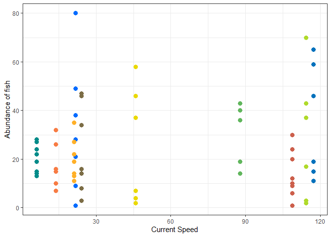
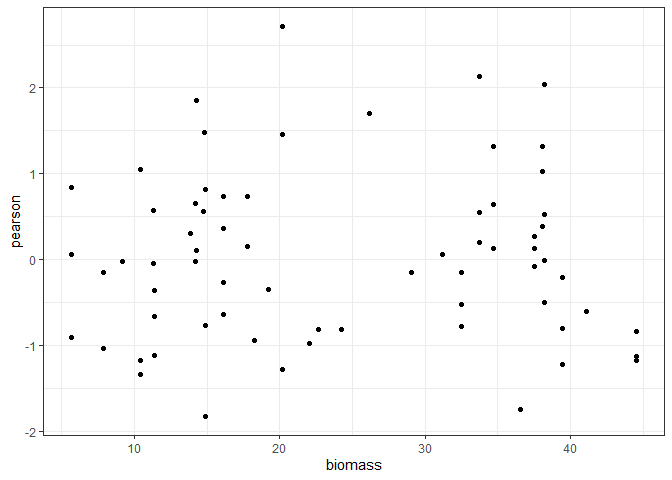

Mixed models for Hi-Lo fish analysis
================
Fiona Francis
5/19/2021

This is the data analysis for Jill Campbell’s MSc chapter that
complements the HiLo analysis for Sharon Jeffrey. This analysis examines
the effect of current and other abiotic facotrs on fish abudnace,
biomass and diversity at different sites in the Gulf Islands. THe data
was collected slightly differently thant the invertebrate data so the
the number of points and sites differ betweent the two studies. This
project also invovles collaboration with Sharon Jeffery, Sarah Dudas and
Francis Juanes.

Jill used a total of 10 sites and recorded fish on transects at two
deptsh: 3 m and 15 m. Each site was visited 3 or 4 times over the
season. Current speed was measured at each site over the course of one
month and the analyses use the mean daily max current measures. Site
will be included as a random effect in models. Abiotic factors are
current speed, depth, rock cover.

## Data

    ## # A tibble: 69 x 18
    ##    Site  CurrentMax CurrentMean.x Hi_Lo TransectDepth CurrDepth Replicate
    ##    <chr>      <dbl>         <dbl> <chr>         <dbl> <chr>         <dbl>
    ##  1 Porl~       117.          64.0 High              3 High 3m           1
    ##  2 Porl~       117.          64.0 High              3 High 3m           2
    ##  3 Porl~       117.          64.0 High              3 High 3m           3
    ##  4 Porl~       117.          64.0 High             15 High 15m          1
    ##  5 Porl~       117.          64.0 High             15 High 15m          2
    ##  6 Porl~       117.          64.0 High             15 High 15m          3
    ##  7 Grai~       114.          19.6 High              3 High 3m           1
    ##  8 Grai~       114.          19.6 High              3 High 3m           2
    ##  9 Grai~       114.          19.6 High              3 High 3m           3
    ## 10 Grai~       114.          19.6 High             15 High 15m          1
    ## # ... with 59 more rows, and 11 more variables: TransectID <chr>,
    ## #   Richness <dbl>, Abundance <dbl>, Biomass <dbl>, Biomass_kg <dbl>,
    ## #   SlopeAngle <dbl>, PercRock <dbl>, CurrentMin <dbl>, MedianMax <dbl>,
    ## #   meanCurrentSD <dbl>, maxCurrentSD <dbl>

## Exploratory plots of Abundance

Current and transect depth (coloured by richness)



slope and rock cover


## Same plots but of log biomass

Current and Depth


Slope and Rock Cover


# Models of fish abundance

``` r
# hmm these don't actually look that bad haha, Lm1 is top which is not surprising as there is a ton of variation with depth in abundance

#one variable

Null.ab <- lme(Abundance ~ 1, 
            random = ~ 1 | Site, data = data, method = "ML")

Lm1.ab <-  lme(Abundance ~ TransectDepth, 
            random = ~ 1 | Site, data = data, method = "ML")

Lm2.ab <-  lme(Abundance ~ CurrentMax,
            random = ~ 1 | Site, data = data, method = "ML")

Lm3.ab <- lme(Abundance ~ SlopeAngle,
            random = ~ 1 | Site, data = data, method = "ML")

Lm4.ab <- lme(Abundance ~ PercRock,
            random = ~ 1 | Site, data = data, method = "ML")

#two variables

Lm5.ab  <- lme(Abundance ~ TransectDepth + CurrentMax, 
            random = ~ 1 | Site, data = data, method = "ML")

Lm6.ab  <- lme(Abundance ~ TransectDepth + SlopeAngle, 
            random = ~ 1 | Site, data = data, method = "ML")

Lm7.ab  <- lme(Abundance ~ TransectDepth + PercRock, 
            random = ~ 1 | Site, data = data, method = "ML")

Lm8.ab  <- lme(Abundance ~ SlopeAngle + CurrentMax, 
            random = ~ 1 | Site, data = data, method = "ML")

Lm9.ab  <- lme(Abundance ~ SlopeAngle + PercRock, 
            random = ~ 1 | Site, data = data, method = "ML")

Lm10.ab  <- lme(Abundance ~ PercRock + CurrentMax, 
            random = ~ 1 | Site, data = data, method = "ML")

#Three variables
Lm11.ab  <- lme(Abundance ~ CurrentMax + SlopeAngle + PercRock, 
            random = ~ 1 | Site, data = data, method = "ML")

Lm12.ab  <- lme(Abundance ~ TransectDepth + SlopeAngle + PercRock, 
            random = ~ 1 | Site, data = data, method = "ML")

Lm13.ab  <- lme(Abundance ~ TransectDepth + CurrentMax + PercRock, 
            random = ~ 1 | Site, data = data, method = "ML")

Lm14.ab  <- lme(Abundance ~ TransectDepth + CurrentMax + SlopeAngle, 
            random = ~ 1 | Site, data = data, method = "ML")
# four variables

Lm15.ab  <- lme(Abundance ~ CurrentMax + TransectDepth + SlopeAngle + PercRock, 
            random = ~ 1 | Site, data = data, method = "ML")


bbmle::AICtab(Null.ab, Lm1.ab, Lm2.ab, Lm3.ab, Lm4.ab, Lm5.ab, Lm6.ab, Lm7.ab, Lm8.ab, Lm9.ab, Lm10.ab, Lm11.ab, Lm12.ab, Lm13.ab, Lm14.ab, Lm15.ab, base = T, weights = T, logLik = T)
```

    ##         logLik AIC    dLogLik dAIC   df weight
    ## Lm7.ab  -278.4  566.9   17.2     0.0 5  0.4864
    ## Lm12.ab -278.3  568.6   17.3     1.7 6  0.2030
    ## Lm13.ab -278.4  568.8   17.2     1.9 6  0.1852
    ## Lm15.ab -278.3  570.6   17.3     3.7 7  0.0758
    ## Lm1.ab  -282.6  573.1   13.0     6.3 4  0.0213
    ## Lm5.ab  -282.1  574.2   13.5     7.3 5  0.0127
    ## Lm6.ab  -282.3  574.6   13.3     7.7 5  0.0101
    ## Lm14.ab -281.9  575.9   13.7     9.0 6  0.0054
    ## Null.ab -295.6  597.2    0.0    30.4 3  <0.001
    ## Lm4.ab  -294.8  597.5    0.9    30.6 4  <0.001
    ## Lm2.ab  -295.3  598.6    0.3    31.7 4  <0.001
    ## Lm3.ab  -295.4  598.7    0.2    31.9 4  <0.001
    ## Lm9.ab  -294.6  599.2    1.0    32.3 5  <0.001
    ## Lm10.ab -294.7  599.3    1.0    32.4 5  <0.001
    ## Lm8.ab  -295.1  600.3    0.5    33.4 5  <0.001
    ## Lm11.ab -294.5  601.0    1.1    34.2 6  <0.001

``` r
# diagnostics for Lm7.ab

Lm7.ab
```

    ## Linear mixed-effects model fit by maximum likelihood
    ##   Data: data 
    ##   Log-likelihood: -278.4377
    ##   Fixed: Abundance ~ TransectDepth + PercRock 
    ##   (Intercept) TransectDepth      PercRock 
    ##   -19.3670215     1.8130084     0.2947264 
    ## 
    ## Random effects:
    ##  Formula: ~1 | Site
    ##         (Intercept) Residual
    ## StdDev:    2.061944 13.53999
    ## 
    ## Number of Observations: 69
    ## Number of Groups: 10

``` r
plot(Lm7.ab) # pretty cone shaped not great
```

<!-- -->

``` r
ggplot(data.frame(biomass=predict(Lm7.ab,type="link"),pearson=residuals(Lm1.ab,type="pearson")),
       aes(x=biomass,y=pearson)) +
  geom_point() +
  theme_bw()
```

<!-- -->

``` r
qqnorm(resid(Lm7.ab))#decent
```

<!-- -->

``` r
sjPlot::plot_model(Lm7.ab)
```

<!-- -->

## fitting a variance structure to Lm7.ab

``` r
Lm7.ab.var <- lme(Abundance ~ TransectDepth + PercRock, 
            random = ~ 1 | Site, data = data, method = "ML")

Lm7.ab.var <- update(Lm7.ab, weights = varExp(form = ~fitted(.)),method = "ML")

Lm7.ab.var
```

    ## Linear mixed-effects model fit by maximum likelihood
    ##   Data: data 
    ##   Log-likelihood: -270.0596
    ##   Fixed: Abundance ~ TransectDepth + PercRock 
    ##   (Intercept) TransectDepth      PercRock 
    ##   -22.5460739     1.8882487     0.3180642 
    ## 
    ## Random effects:
    ##  Formula: ~1 | Site
    ##         (Intercept) Residual
    ## StdDev:    4.317864 4.290941
    ## 
    ## Variance function:
    ##  Structure: Exponential of variance covariate
    ##  Formula: ~fitted(.) 
    ##  Parameter estimates:
    ##      expon 
    ## 0.04114667 
    ## Number of Observations: 69
    ## Number of Groups: 10

``` r
plot(Lm7.ab.var)
```

<!-- -->

``` r
qqnorm(Lm7.ab.var)
```

<!-- -->

``` r
# rerun all models with new variance structure
Null.ab.var <- update(Null.ab, weights = varExp(form = ~fitted(.)),method = "ML")
Lm1.ab.var <- update(Lm1.ab, weights = varExp(form = ~fitted(.)),method = "ML")
Lm2.ab.var <- update(Lm2.ab, weights = varExp(form = ~fitted(.)),method = "ML")
Lm3.ab.var <- update(Lm3.ab, weights = varExp(form = ~fitted(.)),method = "ML")
Lm4.ab.var <- update(Lm4.ab, weights = varExp(form = ~fitted(.)),method = "ML")
Lm5.ab.var <- update(Lm5.ab, weights = varExp(form = ~fitted(.)),method = "ML")
Lm6.ab.var <- update(Lm6.ab, weights = varExp(form = ~fitted(.)),method = "ML")
Lm7.ab.var <- update(Lm7.ab, weights = varExp(form = ~fitted(.)),method = "ML")
Lm8.ab.var <- update(Lm8.ab, weights = varExp(form = ~fitted(.)),method = "ML")
Lm9.ab.var <- update(Lm9.ab, weights = varExp(form = ~fitted(.)),method = "ML")
Lm10.ab.var <- update(Lm10.ab, weights = varExp(form = ~fitted(.)),method = "ML")
Lm11.ab.var <- update(Lm11.ab, weights = varExp(form = ~fitted(.)),method = "ML")
Lm12.ab.var <- update(Lm12.ab, weights = varExp(form = ~fitted(.)),method = "ML")
Lm13.ab.var <- update(Lm13.ab, weights = varExp(form = ~fitted(.)),method = "ML")
Lm14.ab.var <- update(Lm14.ab, weights = varExp(form = ~fitted(.)),method = "ML")
Lm15.ab.var <- update(Lm15.ab, weights = varExp(form = ~fitted(.)),method = "ML")

bbmle::AICtab(Null.ab.var, Lm1.ab.var, Lm2.ab.var, Lm3.ab.var, Lm4.ab.var, Lm5.ab.var, Lm6.ab.var, Lm7.ab.var, Lm8.ab.var, Lm9.ab.var, 
              Lm10.ab.var, Lm11.ab.var, Lm12.ab.var, Lm13.ab.var, Lm14.ab.var, Lm15.ab.var, base = T, weights = T, logLik = T)
```

    ##             logLik AIC    dLogLik dAIC   df weight
    ## Lm13.ab.var -268.2  550.5   27.4     0.0 7  0.4828
    ## Lm7.ab.var  -270.1  552.1   25.6     1.7 6  0.2105
    ## Lm15.ab.var -268.2  552.3   27.5     1.9 8  0.1910
    ## Lm12.ab.var -269.7  553.5   25.9     3.0 7  0.1067
    ## Lm14.ab.var -272.7  559.4   22.9     8.9 7  0.0056
    ## Lm6.ab.var  -274.8  561.5   20.9    11.0 6  0.0019
    ## Lm1.ab.var  -276.7  563.3   18.9    12.9 5  <0.001
    ## Lm5.ab.var  -276.0  564.0   19.6    13.5 6  <0.001
    ## Lm4.ab.var  -292.5  595.1    3.1    44.6 5  <0.001
    ## Lm10.ab.var -292.0  596.0    3.6    45.5 6  <0.001
    ## Lm2.ab.var  -293.8  597.6    1.8    47.2 5  <0.001
    ## Lm9.ab.var  -293.5  599.0    2.1    48.6 6  <0.001
    ## Null.ab.var -295.6  599.2    0.0    48.8 4  <0.001
    ## Lm3.ab.var  -295.3  600.6    0.3    50.2 5  <0.001
    ## Lm11.ab.var -293.6  601.2    2.0    50.7 7  <0.001
    ## Lm8.ab.var  -294.8  601.7    0.8    51.2 6  <0.001

# now looking at model 13 (TransectDepth + CurrentMax + PercRock)

We are looking here at model 13 but there are 3 models (13, 7 and 15)
which are all within 2 delta AIC.

``` r
# diagnostics for Lm13.ab.var

Lm13.ab.var
```

    ## Linear mixed-effects model fit by maximum likelihood
    ##   Data: data 
    ##   Log-likelihood: -268.2296
    ##   Fixed: Abundance ~ TransectDepth + CurrentMax + PercRock 
    ##   (Intercept) TransectDepth    CurrentMax      PercRock 
    ##  -21.81503938    1.94392625   -0.06542779    0.34703008 
    ## 
    ## Random effects:
    ##  Formula: ~1 | Site
    ##         (Intercept) Residual
    ## StdDev:    3.591154  4.02934
    ## 
    ## Variance function:
    ##  Structure: Exponential of variance covariate
    ##  Formula: ~fitted(.) 
    ##  Parameter estimates:
    ##      expon 
    ## 0.04262456 
    ## Number of Observations: 69
    ## Number of Groups: 10

``` r
summary(Lm13.ab.var)
```

    ## Linear mixed-effects model fit by maximum likelihood
    ##  Data: data 
    ##        AIC      BIC    logLik
    ##   550.4592 566.0979 -268.2296
    ## 
    ## Random effects:
    ##  Formula: ~1 | Site
    ##         (Intercept) Residual
    ## StdDev:    3.591154  4.02934
    ## 
    ## Variance function:
    ##  Structure: Exponential of variance covariate
    ##  Formula: ~fitted(.) 
    ##  Parameter estimates:
    ##      expon 
    ## 0.04262456 
    ## Fixed effects: Abundance ~ TransectDepth + CurrentMax + PercRock 
    ##                    Value Std.Error DF   t-value p-value
    ## (Intercept)   -21.815039  8.629793 57 -2.527875  0.0143
    ## TransectDepth   1.943926  0.293078 57  6.632805  0.0000
    ## CurrentMax     -0.065428  0.038570  8 -1.696332  0.1283
    ## PercRock        0.347030  0.087101 57  3.984239  0.0002
    ##  Correlation: 
    ##               (Intr) TrnscD CrrntM
    ## TransectDepth -0.612              
    ## CurrentMax    -0.040 -0.042       
    ## PercRock      -0.934  0.496 -0.232
    ## 
    ## Standardized Within-Group Residuals:
    ##         Min          Q1         Med          Q3         Max 
    ## -1.82504777 -0.77554621 -0.02917263  0.56913152  2.71370048 
    ## 
    ## Number of Observations: 69
    ## Number of Groups: 10

``` r
plot(Lm13.ab.var)
```

<!-- -->

``` r
ggplot(data.frame(biomass=predict(Lm13.ab.var,type="link"),pearson=residuals(Lm13.ab.var,type="pearson")),
       aes(x=biomass,y=pearson)) +
  geom_point() +
  theme_bw()
```

<!-- -->

``` r
qqnorm(resid(Lm13.ab.var))
```

<!-- -->

``` r
sjPlot::plot_model(Lm13.ab.var)
```

<!-- -->

# Models of fish biomass

    ##          logLik AIC    dLogLik dAIC   df weight
    ## Lm1.bio   -95.9  199.9  574.6     0.0 4  0.2708
    ## Lm6.bio   -95.5  201.0  575.0     1.1 5  0.1524
    ## Lm5.bio   -95.6  201.1  575.0     1.2 5  0.1471
    ## Lm7.bio   -95.6  201.1  575.0     1.2 5  0.1469
    ## Lm12.bio  -95.1  202.3  575.4     2.4 6  0.0828
    ## Lm14.bio  -95.3  202.5  575.3     2.7 6  0.0719
    ## Lm13.bio  -95.3  202.6  575.3     2.7 6  0.0711
    ## Null.bio  -99.7  205.4  570.9     5.5 3  0.0174
    ## Lm3.bio   -99.2  206.5  571.3     6.6 4  0.0101
    ## Lm2.bio   -99.3  206.6  571.2     6.8 4  0.0093
    ## Lm4.bio   -99.7  207.3  570.9     7.4 4  0.0066
    ## Lm8.bio   -99.0  208.0  571.5     8.1 5  0.0047
    ## Lm9.bio   -99.2  208.4  571.3     8.5 5  0.0039
    ## Lm10.bio  -99.3  208.6  571.2     8.7 5  0.0034
    ## Lm11.bio  -99.0  210.0  571.5    10.1 6  0.0017
    ## Lm15.bio -670.5 1355.1    0.0  1155.2 7  <0.001

## Looking at model 1 but again there are 4 models within 2 delta AIC (1, 6, 5, and 7). Depth is clearly very important but the other three models contain each of the other variables of interest.

    ## Linear mixed-effects model fit by maximum likelihood
    ##   Data: data 
    ##   Log-likelihood: -95.94696
    ##   Fixed: log10(Biomass) ~ TransectDepth 
    ##   (Intercept) TransectDepth 
    ##    2.30042295    0.05074164 
    ## 
    ## Random effects:
    ##  Formula: ~1 | Site
    ##         (Intercept)  Residual
    ## StdDev:   0.5059858 0.8934504
    ## 
    ## Number of Observations: 69
    ## Number of Groups: 10

<!-- --><!-- --><!-- --><!-- --><!-- --><!-- -->
